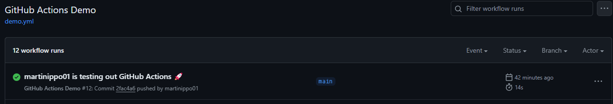

# CI/CD with GitHub Actions: Step-by-Step Guide

## Introduction

This guide will walk you through setting up a CI/CD pipeline using GitHub Actions. Our pipeline will build code, run unit tests, deploy to a container, and handle notifications and manual approvals. Additionally, we'll set up multi-environment deployments.

## Prerequisites

1. **Git and GitHub Account**: Ensure you have Git installed and a GitHub account.
2. **Docker**: Install Docker to manage containers.
3. **AWS Account (Optional)**: For deploying using AWS services like EKS, ECS, or Lambda.

Side note: This guide and demo will deploy to AWS, but this is not required for using CI/CD with github actions.

## Step 1: Create a GitHub Repository

1. Go to [GitHub](https://github.com) and log in.
2. Click on the **+** icon and select **New repository**.
3. Name your repository, provide a description, and click **Create repository**.

For new github users, check out the [GitHub documentation on repositories](https://docs.github.com/en/repositories/creating-and-managing-repositories/quickstart-for-repositories)

## Step 2: Set Up GitHub Actions

1. Clone your repository localy ([GitHub documentation on cloning a repository](https://docs.github.com/en/repositories/creating-and-managing-repositories/cloning-a-repository))
2. Step into the root of the repository. To make sure you are in the root, run `ls -a` and you should see a directory named `.git`
3. Create a file `ci-cd.yml`, inside the directory `./.githubactions/workflows` (Create both directories if necessary)

Inside the file created, copy the following code:
```yaml
name: GitHub Actions Demo
run-name: ${{ github.actor }} is testing out GitHub Actions 🚀

on:
  push:
    branches:
      - main

jobs:
  Explore-GitHub-Actions:
    runs-on: ubuntu-latest
    steps:
      - run: echo "🎉 The job was automatically triggered by a ${{ github.event_name }} event."
      - run: echo "🐧 This job is now running on a ${{ runner.os }} server hosted by GitHub!"
      - run: echo "🔎 The name of your branch is ${{ github.ref }} and your repository is ${{ github.repository }}."
      - name: Check out repository code
        uses: actions/checkout@v4
      - run: echo "💡 The ${{ github.repository }} repository has been cloned to the runner."
      - run: echo "🖥️ The workflow is now ready to test your code on the runner."
      - name: List files in the repository
        run: |
          ls ${{ github.workspace }}
      - run: echo "🍏 This job's status is ${{ job.status }}."
```
4. Remeber to save all changes
5. Commit and push the changes to origin (the github repository created)

In order to check that the action created was successfuly created, open your repository on GitHub and select the _actions_ tab. You should be able to see the action running or completed.



## Step 3: Define Your Workflow

### 3.1 Basic Workflow Structure

```yaml
name: CI/CD Pipeline

on:
  push:
    branches:
      - main

jobs:
  build:
    runs-on: ubuntu-latest
    steps:
      - name: Checkout code
        uses: actions/checkout@v2

      - name: Set up Docker
        uses: docker/setup-buildx-action@v1

      - name: Build Docker image
        run: docker build -t your-image-name .

      - name: Run unit tests
        run: docker run --rm your-image-name sh -c "npm install && npm test"

      - name: Login to Docker Hub
        run: echo "${{ secrets.DOCKER_HUB_PASSWORD }}" | docker login -u "${{ secrets.DOCKER_HUB_USERNAME }}" --password-stdin

      - name: Push Docker image
        run: docker push your-image-name
```

### 3.2 Add Notifications

Use a GitHub Action to send notifications. For example, using Slack:

```yaml
      - name: Notify Slack - Success
        if: success()
        uses: rtCamp/action-slack-notify@v2
        with:
          status: success
          fields: repo, commit, author
        env:
          SLACK_WEBHOOK: ${{ secrets.SLACK_WEBHOOK }}

      - name: Notify Slack - Failure
        if: failure()
        uses: rtCamp/action-slack-notify@v2
        with:
          status: failure
          fields: repo, commit, author
        env:
          SLACK_WEBHOOK: ${{ secrets.SLACK_WEBHOOK }}
```

### 3.3 Manual Approval Process

Add a manual approval step using `workflow_dispatch`:

```yaml
  approve-deployment:
    runs-on: ubuntu-latest
    needs: build
    steps:
      - name: Wait for approval
        uses: actions/github-script@v4
        with:
          script: |
            const { GITHUB_TOKEN } = process.env;
            const { Octokit } = require("@octokit/rest");
            const octokit = new Octokit({ auth: GITHUB_TOKEN });

            const [owner, repo] = process.env.GITHUB_REPOSITORY.split('/');
            const { data: { checks } } = await octokit.checks.listForRef({
              owner,
              repo,
              ref: process.env.GITHUB_SHA,
            });

            const check_run_id = checks[0].id;

            await octokit.checks.update({
              owner,
              repo,
              check_run_id,
              status: "in_progress",
              conclusion: "neutral",
            });
            
            console.log("Waiting for approval...");
```

### 3.4 Multi-Environment Deployment

Deploy to development first and then to production upon approval:

```yaml
  deploy-development:
    runs-on: ubuntu-latest
    needs: approve-deployment
    steps:
      - name: Deploy to Development
        run: |
          docker run -d -p 80:80 --name my-app-dev your-image-name

  deploy-production:
    runs-on: ubuntu-latest
    needs: deploy-development
    steps:
      - name: Deploy to Production
        run: |
          docker run -d -p 80:80 --name my-app-prod your-image-name
```

## Step 4: Configure Secrets

In your GitHub repository, go to **Settings > Secrets** and add the following secrets:
- `DOCKER_HUB_USERNAME`
- `DOCKER_HUB_PASSWORD`
- `SLACK_WEBHOOK`

## Step 5: Testing and Deployment

Push code to your repository's main branch and observe the workflow running:
1. Code is built and tested.
2. Docker image is created and pushed to Docker Hub.
3. Notifications are sent.
4. Manual approval is requested.
5. Upon approval, the code is deployed to development and production environments.

## Optional: Web or Mobile App Deployment and UX/UI Testing

For web or mobile apps, consider using tools like Selenium for web UI testing or Appium for mobile app testing. Integrate these tests into your GitHub Actions workflow.

### Example for Selenium:

```yaml
      - name: Set up Selenium
        uses: actions/selenium/selenium-action@v1

      - name: Run UI Tests
        run: |
          docker run --rm your-image-name sh -c "npm install && npm run ui-test"
```

## Conclusion

You've now set up a CI/CD pipeline using GitHub Actions, covering code building, testing, notifications, manual approvals, and multi-environment deployments. This setup ensures a robust and automated workflow for your development and deployment processes.
